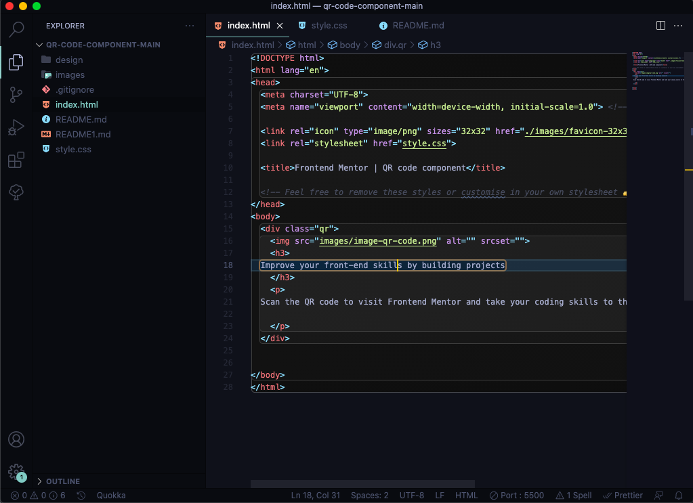

# Frontend Mentor - QR code component solution

This is a solution to the [QR code component challenge on Frontend Mentor](https://www.frontendmentor.io/challenges/qr-code-component-iux_sIO_H). Frontend Mentor challenges help you improve your coding skills by building realistic projects. 

## Table of contents

- [Screenshot](#screenshot)
- [Links](#links)
- [Built with](#built-with)
- [What I learned](#what-i-learned)
- [Author](#author)
- [Acknowledgments](#acknowledgments)

**Note: Delete this note and update the table of contents based on what sections you keep.**


### Screenshot



Add a screenshot of your solution. The easiest way to do this is to use Firefox to view your project, right-click the page and select "Take a Screenshot". You can choose either a full-height screenshot or a cropped one based on how long the page is. If it's very long, it might be best to crop it.

### Links

- Solution URL: [Solution URL](https://github.com/adeope63/qr-code-component-main)


### Built with

- Semantic HTML5 markup
- CSS custom properties
- Flexbox
- CSS Grid
- Mobile-first workflow
- [Styled Components] Basic CSS - For styles


### What I learned

Use this section to recap over some of your major learnings while working through this project. Writing these out and providing code samples of areas you want to highlight is a great way to reinforce your own knowledge.

To see how you can add code snippets, see below:

```html
  <h3>
  Improve your front-end skills by building projects
  </h3>
```
```css
.qr{
    background: hsl(0, 0%, 100%);
    height: 450px;
    width: 300px;
    text-align: center;
    border-radius: 20px;
    margin: 130px auto;
    display: block;
}
```


## Author

- Website - [Adefila Mustapha](https://www.adeope.org)
- Frontend Mentor - [@adeope63](https://www.frontendmentor.io/profile/adeope63)
- Twitter - [@adeope63](https://www.twitter.com/adeope63)


## Acknowledgments

I want to say a big thank you to Frontend Mentor for giving me this opportunity to prove myself and improve my skills in CSS and HTML with this task.

